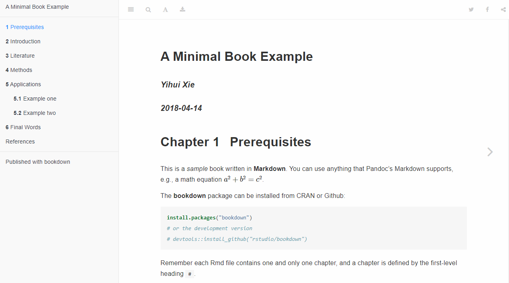

# Books

We have introduced the basics of R Markdown in Chapter \@ref(documents), which highlighted how HTML, PDF and Word documents can be produced from an R workflow.  The **bookdown** package [@R-bookdown] extends R Markdown and simplifies the creation of books and long-form documents. It allows for multiple R Markdown documents to easily be combined into a single book, adds additional features including numbering and cross-referencing figures/tables/sections/equations, inserting parts/appendices and can output elegant and appealing multi-page HTML book pages. This book itself is an example of how you can produce a book from a series of R Markdown documents, and both the printed version and the online version can look professional.

Despite the package name containing the word "book", **bookdown** is not only for books. The "book" can be anything that consists of multiple R Markdown documents meant to be read in a linear sequence, such as course handouts, study notes, a software manual, a thesis, or even a diary. In fact, many **bookdown** features apply to single R Markdown documents as well (see Section \@ref(a-single-document)).

In this chapter, we cover the basics of bookdown and explain how to get up and running with the project. Much of the the content is based on the work "bookdown: Authoring Books and Technical Documents with R Markdown" (https://bookdown.org/yihui/bookdown/) of @xie2016, which is recommended for reference more further explanation of the concepts.

## Get started

You can install either the CRAN version or the development version on GitHub (https://github.com/rstudio/bookdown):

<!--- Is the convention of the book to explain that packages can be installed from GitHub? --->

```{r eval=FALSE}
# install from CRAN
install.packages('bookdown')
    
# or GitHub
devtools::install_github('rstudio/bookdown')
```

If you use RStudio, you can start a new bookdown project from the menu `File -> New Project... -> New Directory -> Book Project using bookdown`.^[Alternatively, the command `bookdown:::bookdown_skeleton(getwd())` (N.B. `:::`) will create a skeleton project in your current working directory.] Open the R Markdown file `index.Rmd` and click the button Build Book on the Build tab of RStudio. Now you should see the index page of this book demo in the RStudio Viewer, which looks like Figure \@ref(fig:bookdown-template).  

You may add or change the R Markdown files, and hit the `Knit` button again to preview the book. If you prefer not to use RStudio, you may also compile the book through the command line. See Section \@ref(usage) for details.

```{r bookdown-template, echo=FALSE, fig.cap= "The HTML output of the bookdown template", out.width='100%'}

```

## Project Structure

It can at first seem overwhelming starting a bookdown project, as there are quite a few files in the basic template. Below shows the basic structure of the bookdown template:

```markdown
directory/
├── 01-intro.Rmd
├── 02-literature.Rmd
├── 03-method.Rmd
├── 04-application.Rmd
├── 05-summary.Rmd
├── 06-references.Rmd
├── _bookdown.yml
├── _output.yml
├──  book.bib
├──  index.Rmd
├──  preamble.tex
├──  README.md
└──  style.css
```
<!---
Potential to replace diagram by extracting file structure directly from the package 
list.files(bookdown:::bookdown_file("rstudio", "templates", "project", "resources"))
--->

As a summary of these files:

- `index.Rmd`: This is the only Rmd document to contain a YAML frontmatter as described within the \@ref(basics), and is the first book chapter.
- `Rmd files`: a typical **bookdown** book contains multiple chapters, and one chapter lives in one Rmd file.
- `_bookdown.yml`: settings to control how bookdown builds the book.
- `output.yml`: specifies the formatting of the HTML, LaTeX/PDF and e-books.
- `preamble.tex` & `style.css`: allows for the appearance and styles of the files to be adjusted. Adjusting these are beyond the scope of this chapter, but are covered in Section \@ref(customization).

<!--- Add a chapter on customization --->

These files are explained in greater detail within the following subsections. 

### index File

If there exists an Rmd file named `index.Rmd`, it will always be treated as the first file when merging all Rmd files. The appearance of this file is more familiar to the original R Markdown filetype and includes the YAML header:

```yaml
---
title: "A Minimal Book Example"
author: "Yihui Xie"
date: "`r Sys.Date()`"
site: bookdown::bookdown_site
documentclass: book
bibliography: [book.bib, packages.bib]
biblio-style: apalike
link-citations: yes
description: "This is a minimal example of using the bookdown package to write a book."
---
```

### Rmd files

Each R Markdown file does not require its own YAML header, but must start immediately with the chapter title using the first-level heading, e.g., `# Chapter Title`.

- 01-intro.Rmd

    ```markdown
    # Introduction
    
    This chapter is an overview of the methods that
    we propose to solve an **important problem**.
    ```
    
- 02-literature.Rmd

    ```markdown
    # Literature
    
    Here is a review of existing methods.
    ```

By default, bookdown merges all Rmd files by the order of filenames, e.g., `01-intro.Rmd` will appear before `02-literature.Rmd`. Filenames that start with an underscore `_` are skipped.

Although we have been talking about R Markdown files, the chapter files do not actually have to be R Markdown. They can be plain Markdown files (`.md`), and do not have to contain R code chunks at all. You can certainly use **bookdown** to compose novels or poems!

### _bookdown.yml

The `bookdown.yml` file allows you to specify optional setting used to be build the book. You can override the merging order of files by including  the field `rmd_files` in `_bookdown.yml`\index{\_bookdown.yml}.  For example,

```yaml
rmd_files: ["index.Rmd", "abstract.Rmd", "intro.Rmd"]
```

In this case, **bookdown** will just use whatever you defined in this YAML field without any special treatments of `index.Rmd` or underscores. If you want both HTML and LaTeX/PDF output from the book, and use different Rmd files for HTML and LaTeX output, you may specify these files for the two output formats separately, e.g.,

```yaml
rmd_files:
  html: ["index.Rmd", "abstract.Rmd", "intro.Rmd"]
  latex: ["abstract.Rmd", "intro.Rmd"]
```

### _output.yml

The `output.yml` file is used to specify the output formats book, and allows for the customisation of the styles. Here is a brief example:

```yaml
bookdown::gitbook:
  lib_dir: assets
  split_by: section
  config:
    toolbar:
      position: static
bookdown::pdf_book:
  keep_tex: yes
bookdown::html_book:
  css: toc.css
```

Section \@ref(bookdown-output) provides further detail on how the output formats can be customised.

## R Markdown Extensions

**Bookdown** expands upon the markdown syntax Section outlined in \@ref(markdown-syntax), and provides a number of tools useful for academic writing, including math equations and cross referencing. This section is adapted from [Section 2.2](https://bookdown.org/yihui/bookdown/markdown-extensions-by-bookdown.html#equations) of @xie2016, where further examples are provided of syntax usage.

### Number and reference equations {#equations}

Section \@ref(math-expressions) highlighted how equations can be created using LaTeX syntax within Markdown. To number and refer to equations\index{equation}\index{cross-reference}, put them in the equation environments and assign labels to them using the syntax `(\#eq:label)`. Equation labels must start with the prefix `eq:` in **bookdown**. All labels in **bookdown** must only contain alphanumeric characters, `:`, `-`, and/or `/`. e.g.,

```latex
\begin{equation} 
  f\left(k\right) = \binom{n}{k} p^k\left(1-p\right)^{n-k}
  (\#eq:binom)
\end{equation} 
```

It renders the equation below:

\begin{equation}
f\left(k\right)=\binom{n}{k}p^k\left(1-p\right)^{n-k} (\#eq:binom)
\end{equation}

You may refer to it using `\@ref(eq:binom)`, e.g., see Equation \@ref(eq:binom). 

### Theorems and proofs {#theorems}

Theorems\index{theorem} and proofs are commonly used in articles and books in mathematics. However, please do not be misled by the names: a "theorem" is just a numbered/labeled environment, and it does not have to be a mathematical theorem (e.g., it can be an example irrelevant to mathematics). Similarly, a "proof" is an unnumbered environment. In this section, we always use the _general_ meanings of a "theorem" and "proof" unless explicitly stated.

In **bookdown**, the types of theorem environments supported are in Table \@ref(tab:theorem-envs). To write a theorem, you can use the syntax below:

````markdown
`r ''````{theorem}
Here is my theorem.
```
````

(ref:theorem-envs) Theorem environments in **bookdown**.

```{r theorem-envs, echo=FALSE}
knitr::kable(data.frame(
  Environment = names(bookdown:::theorem_abbr),
  `Printed Name` = unname(unlist(bookdown:::label_names_math)),
  `Label Prefix` = unname(bookdown:::theorem_abbr),
  stringsAsFactors = FALSE, check.names = FALSE
), caption = '(ref:theorem-envs)', booktabs = TRUE)
```

To write other theorem environments, replace ```` ```{theorem} ```` with other environment names in Table \@ref(tab:theorem-envs), e.g., ```` ```{lemma} ````.

A theorem can have a `name` option so its name will be printed. If you want to refer to a theorem, you should label it. The label can be written after ```` ```{theorem````, For example, we have a labeled and named theorem below, and `\@ref(thm:pyth)` gives us its theorem number \@ref(thm:pyth):

````markdown
`r ''````{theorem, pyth, name="Pythagorean theorem"}
For a right triangle, if $c$ denotes the length of the hypotenuse
and $a$ and $b$ denote the lengths of the other two sides, we have

$$a^2 + b^2 = c^2$$
```
````

After you label a theorem, you can refer to it using the syntax `\@ref(prefix:label)`.\index{cross-reference} See the column `Label Prefix` in Table \@ref(tab:theorem-envs) for the value of `prefix` for each environment.


```{theorem, pyth, name="Pythagorean theorem"}
For a right triangle, if $c$ denotes the length of the hypotenuse
and $a$ and $b$ denote the lengths of the other two sides, we have

$$a^2 + b^2 = c^2$$
```

The proof environments currently supported are `r knitr::combine_words(names(bookdown:::label_names_math2), before = '\x60')`. The syntax is similar to theorem environments, and proof environments can also be named. The only difference is that since they are unnumbered, you cannot reference them.

Theorems are numbered by chapters by default. If there are no chapters in your document, they are numbered by sections instead. If the whole document is unnumbered (the output format option `number_sections = FALSE`), all theorems are numbered sequentially from 1, 2, ..., N.

Theorem and proof environments will be hidden if the chunk option `echo` is set to `FALSE`. To make sure they are always shown, you may add the chunk option `echo=TRUE`, e.g.,

````markdown
`r ''````{theorem, echo=TRUE}
Here is my theorem.
```
````

### Special headers

There are a few special types of first-level headers that will be processed differently in **bookdown**. The first type is an unnumbered header that starts with the token `(PART)`. This kind of headers are translated to part titles\index{part}. If you are familiar with LaTeX, this basically means `\part{}`. When your book has a large number of chapters, you may want to organize them into parts, e.g.,

```
# (PART) Part I {-} 

# Chapter One

# Chapter Two

# (PART) Part II {-} 

# Chapter Three
```

A part title should be written right before the first chapter title in this part. You can use `(PART\*)` (the backslash before `*` is required) instead of `(PART)` if a part title should not be numbered.

The second type is an unnumbered header that starts with `(APPENDIX)`, indicating that all chapters after this header are appendices\index{appendix}, e.g.,

```
# Chapter One 

# Chapter Two

# (APPENDIX) Appendix {-} 

# Appendix A

# Appendix B
```

The numbering style of appendices will be automatically changed in LaTeX/PDF and HTML output (usually in the form A, A.1, A.2, B, B.1, ...). This feature is not available to e-books or Word output.

### Text references

You can assign some text to a label and reference the text using the label elsewhere in your document. This can be particularly useful for long figure/table captions (Section \@ref(figures) and \@ref(tables)), in which case you normally will have to write the whole character string in the chunk header (e.g., `fig.cap = "A long long figure caption."`) or your R code (e.g., `kable(caption = "A long long table caption.")`). It is also useful when these captions contain special HTML or LaTeX characters, e.g., if the figure caption contains an underscore, it works in the HTML output but may not work in LaTeX output because the underscore must be escaped in LaTeX.

The syntax for a text reference is `(ref:label) text`, where `label` is a unique label^[You may consider using the code chunk labels.] throughout the document for `text`. It must be in a separate paragraph with empty lines above and below it. The paragraph must not be wrapped into multiple lines, and should not end with a white space. For example,

```markdown
(ref:foo) Define a text reference **here**. 
```

Then you can use `(ref:foo)` in your figure/table captions. The text can contain anything that Markdown supports, including inline code (Section \@ref(r-code)), as long as it is one single paragraph. Here is a complete example:

````markdown
A normal paragraph.

(ref:foo) A scatterplot of the data `cars` using **base** R graphics. Number of points = `r nrow(cars)`

`r ''````{r foo, fig.cap='(ref:foo)'}
plot(cars)  # a scatterplot
```
````

Text references can be used anywhere in the document (not limited to figure captions). It can also be useful if you want to reuse a fragment of text in multiple places.

### Cross Referencing

Within R Markdown, it is possible to refer to Section headers. The header identifier is automatically generated from the header text by default,^[To see more details on how an identifier is automatically generated, see the `auto_identifiers` extension in Pandoc's documentation http://pandoc.org/MANUAL.html#header-identifiers] and you can manually specify an identifier using the syntax `{#your-custom-id}` after the header text, e.g.,

```markdown
# An Introduction {#introduction}

The default identifier is `an-introduction` but we changed
it to `introduction`.
```

**Bookdown** extends this, and allows references to be made to tables, figures and equations. If we assign a figure caption to a code chunk via the chunk option `fig.cap`, R plots will be put into figure environments, which will be automatically labeled and numbered, and can also be cross-referenced. The label of a figure environment is generated from the label of the code chunk, e.g., if the chunk label is `foo`, the figure label will be `fig:foo` (the prefix `fig:` is added before `foo`). To reference a figure\index{cross-reference}, use the syntax `\@ref(label)`,^[Do not forget the leading backslash! And also note the parentheses `()` after `ref`; they are not curly braces `{}`.] where `label` is the figure label, e.g., `fig:foo`.

As an example:

````markdown
See Figure \@ref(fig:foo)

`r ''````{r foo, fig.cap= "A scatterplot"}
plot(cars)  # a scatterplot
```
````

Like figures, tables with captions will also be numbered and can be referenced. The `kable()` function will automatically generate a label for a table environment, which is the prefix `tab:` plus the chunk label. For example, the table label for a code chunk with the label `foo` will be `tab:foo`, and we can still use the syntax `\@ref(label)` to reference the table. Table \@ref(tab:table-single) is a simple example.

```{r table-single, tidy=FALSE}
knitr::kable(
  head(mtcars[, 1:8], 10), booktabs = TRUE,
  caption = 'A table of the first 10 rows of the mtcars data.'
)
```

## Output Formats {#bookdown-output}

The **bookdown** package primarily supports three types of output formats: HTML, LaTeX/PDF. In this section, we introduce the possible options for these formats.

### HTML

The main difference between rendering a book (using **bookdown**) with rendering a single R Markdown document (using **rmarkdown**) to HTML\index{HTML} is that a book will generate multiple HTML pages by default --- normally one HTML file per chapter. This makes it easier to bookmark a certain chapter or share its URL with others as you read the book, and faster to load a book into the web browser. Currently we have provided a number of different styles for HTML output: the GitBook style, the Bootstrap style, and the Tufte style.

#### GitBook style {#gitbook-style}

The GitBook style was borrowed from GitBook\index{GitBook}, a project launched by Friendcode, Inc. (https://www.gitbook.com). It provides a beautiful style, with a layout consisting of a sidebar showing the table of contents on the left, and the main body of a book on the right, and the design is responsive to the window size. Several improvements were made over the original Gitbook project to allow code

```{r gitbook-args, code=formatR::usage(bookdown::gitbook, output=FALSE, fail='none'), eval=FALSE, R.options=list(width=50)}
```

Most arguments are passed to `rmarkdown::html_document()`, including `fig_caption`, `lib_dir`, and `...`. You can check out the help page of `rmarkdown::html_document()` for the full list of possible options,  and also check Section \@ref(html-document).

Besides these `html_document()` options, `gitbook()` has three other arguments: `split_by`, `split_bib`, and `config`. The `split_by` argument specifies how you want to split the HTML output into multiple pages, and its possible values are:

- `rmd`: use the base filenames of the input Rmd files to create the HTML filenames, e.g., generate `chapter3.html` for `chapter3.Rmd`.
- `none`: do not split the HTML file (the book will be a single HTML file).
- `chapter`: split the file by the first-level headers.
- `section`: split the file by the second-level headers.
- `chapter+number` and `section+number`: similar to `chapter` and `section`, but the files will be numbered.

By default, the bibliography is split and relevant citation items are put at the bottom of each page, so that readers do not have to navigate to a different bibliography page to see the details of citations. This feature can be disabled using `split_bib = FALSE`, in which case all citations are put on a separate page.

For a full https://bookdown.org/yihui/bookdown/html.html#gitbook-style

#### Bootstrap style


If you have used R Markdown before, you should be familiar with the Bootstrap\index{Bootstrap style} style (http://getbootstrap.com), which is the default style of the HTML output of R Markdown. The output format function in **rmarkdown** is `html_document()`, and we have a corresponding format `html_book()` in **bookdown** using `html_document()` as the base format. In fact, there is a more general format `html_chapters()` in **bookdown** and `html_book()` is just its special case:

```{r html-chapters-usage, eval=FALSE, code=formatR::usage(bookdown::html_chapters, output=FALSE, fail='none')}
```

Note that it has a `base_format` argument that takes a base output format function, and `html_book()` is basically `html_chapters(base_format = rmarkdown::html_document)`. All arguments of `html_book()` are passed to `html_chapters()`:

```{r html-book-usage, eval=FALSE, code=formatR::usage(bookdown::html_book, output=FALSE)}
```


That means that you can use most arguments of `rmarkdown::html_document`, such as `toc` (whether to show the table of contents), `number_sections` (whether to number section headings), and so on. Again, check the help page of `rmarkdown::html_document` to see the full list of possible options. Note that the argument `self_contained` is hard-coded to `FALSE` internally, so you cannot change the value of this argument. We have explained the argument `split_by` in the previous section.

The arguments `template` and `page_builder` are for advanced users, and you do not need to understand them unless you have strong need to customize the HTML output. See https://bookdown.org/yihui/bookdown/html.html#bootstrap-style for details.

#### Tufte style

Like the Bootstrap style, the Tufte\index{Tufte style} style is provided by an output format `tufte_html_book()`, which is also a special case of `html_chapters()` using `tufte::tufte_html()` as the base format. Please see the **tufte** package [@R-tufte] if you are not familiar with the Tufte style. Basically, it is a layout with a main column on the left and a margin column on the right. The main body is in the main column, and the margin column is used to place footnotes, margin notes, references, and margin figures, and so on.

All arguments of `tufte_html_book()` have exactly the same meanings as `html_book()`, e.g., you can also customize the CSS via the `css` option. There are a few elements that are specific to the Tufte style, though, such as margin notes, margin figures, and full-width figures. These elements require special syntax to generate; please see the documentation of the **tufte** package. Note that you do not need to do anything special to footnotes and references (just use the normal Markdown syntax `^[footnote]` and `[@citation]`), since they will be automatically put in the margin. A brief YAML example of the `tufte_html_book` format:

```yaml
---
output:
  bookdown::tufte_html_book:
    toc: yes
    css: toc.css
---
```

### LaTeX/PDF

We strongly recommend that you use an HTML output format instead of LaTeX\index{LaTeX} when you develop a book, since you will not be too distracted by the typesetting details, which can bother you a lot if you constantly look at the PDF output of a book. Leave the job of careful typesetting to the very end (ideally after you have really finished the content of the book).

The LaTeX/PDF output format is provided by `pdf_book()` in **bookdown**. There is not a significant difference between `pdf_book()` and the `pdf_document()` format in **rmarkdown**. The main purpose of `pdf_book()` is to resolve the labels and cross-references written using the syntax described in Sections \@ref(figures), \@ref(tables), and \@ref(cross-references). If the only output format that you want for a book is LaTeX/PDF, you may use the syntax specific to LaTeX, such as `\label{}` to label figures/tables/sections, and `\ref{}` to cross-reference them via their labels, because Pandoc supports LaTeX commands in Markdown. However, the LaTeX syntax is not portable to other output formats, such as HTML and e-books. That is why we introduced the syntax `(\#label)` for labels and `\@ref(label)` for cross-references.

There are some top-level YAML options that will be applied to the LaTeX output. For a book, you may change the default document class to `book` (the default is `article`), and specify a bibliography style required by your publisher. A brief YAML example:

```yaml
---
documentclass: book
bibliography: [book.bib, packages.bib]
biblio-style: apalike
---
```

There are a large number of other YAML options that you can specify for LaTeX output, such as the paper size, font size, page margin, line spacing, font families, and so on. See http://pandoc.org/MANUAL.html#variables-for-latex for a full list of options.

The `pdf_book()` format is a general format like `html_book()`, and it also has a `base_format` argument:

```{r pdf-book-usage, eval=FALSE, code=formatR::usage(bookdown::pdf_book, output=FALSE)}
```

You can change the `base_format` function to other output format functions, and **bookdown** has provided a simple wrapper function `tufte_book2()`, which is basically `pdf_book(base_format = tufte::tufte_book)`, to produce a PDF book using the Tufte PDF style (again, see the **tufte** package).

### E-Books

Currently **bookdown** provides two e-book\index{e-book} formats, EPUB\index{EPUB} and MOBI\index{MOBI}. Books in these formats can be read on devices like smartphones, tablets, or special e-readers such as Kindle.

#### EPUB

To create an EPUB book, you can use the `epub_book()` format. It has some options in common with `rmarkdown::html_document()`:

```{r epub-book, eval=FALSE, code=formatR::usage(bookdown::epub_book, output=FALSE), R.options=list(width=50)}
```

The option `toc` is turned off because the e-book reader can often figure out a TOC automatically from the book, so it is not necessary to add a few pages for the TOC. There are a few options specific to EPUB:

- `stylesheet`: It is similar to the `css` option in HTML output formats, and you can customize the appearance of elements using CSS.
- `cover_image`: The path to the cover image of the book.
- `metadata`: The path to an XML file for the metadata of the book (see Pandoc documentation for more details).
- `chapter_level`: Internally an EPUB book is a series of "chapter" files, and this option determines the level by which the book is split into these files. This is similar to the `split_by` argument of HTML output formats we mentioned in Section \@ref(html), but an EPUB book is a single file, and you will not see these "chapter" files directly. The default level is the first level, and if you set it to 2, it means the book will be organized by section files internally, which may allow the reader to load the book more quickly.
- `epub_version`: Version 3 or 2 of EPUB.

An EPUB book is essentially a collection of HTML pages, e.g., you can apply CSS rules to its elements, embed images, insert math expressions (because MathML is partially supported), and so on. Figure/table captions, cross-references, custom blocks, and citations mentioned in Chapter \@ref(components) also work for EPUB. You may compare the EPUB output of this book to the HTML output, and you will see that the only major difference is the visual appearance.

There are several EPUB readers available, including Calibre (https://www.calibre-ebook.com), Apple's iBooks, and Google Play Books.

#### MOBI

MOBI e-books can be read on Amazon's Kindle devices. Pandoc does not support MOBI output natively, but Amazon has provided a tool named KindleGen (https://www.amazon.com/gp/feature.html?docId=1000765211) to create MOBI books from other formats, including EPUB and HTML. We have provided a simple wrapper function `kindlegen()` in **bookdown** to call KindleGen to convert an EPUB book to MOBI. This requires you to download KindleGen first, and make sure the KindleGen executable can be found via the system environment variable `PATH`.

Another tool to convert EPUB to MOBI is provided by Calibre\index{Calibre}. Unlike KindleGen, Calibre is open-source and free, and supports conversion among many more formats. For example, you can convert HTML to EPUB, Word documents to MOBI, and so on. The function `calibre()` in **bookdown** is a wrapper function of the command-line utility `ebook-convert` in Calibre. Similarly, you need to make sure that the executable `ebook-convert` can be found via the environment variable `PATH`. If you use OS X, you can install both KindleGen and Calibre via Homebrew-Cask (https://caskroom.github.io), so you do not need to worry about the `PATH` issue.

## A single document

Sometimes you may not want to write a book, but a single long-form article or report instead. Usually what you do is call `rmarkdown::render()`\index{rmarkdown::render()} with a certain output format. The main features missing there are the automatic numbering of figures/tables/equations, and cross-referencing figures/tables/equations/sections. We have factored out these features from **bookdown**, so that you can use them without having to prepare a book of multiple Rmd files.

The functions `html_document2()`, `tufte_html2()`, `pdf_document2()`, `word_document2()`, `tufte_handout2()`, and `tufte_book2()` are designed for this purpose. If you render an R Markdown document with the output format, say, `bookdown::html_document2`, you will get figure/table numbers and be able to cross-reference them in the single HTML page using the syntax described in Chapter \@ref(cross-referencing).

The above HTML and PDF output format functions are basically wrappers of output formats `bookdown::html_book` and `bookdown::pdf_book`, in the sense that they changed the `base_format` argument. For example, you can take a look at the source code of `pdf_document2`:

```{r}
bookdown::pdf_document2
```

## Editing

In this section, w explain how to edit, build, preview, and serve the book locally. You can use any text editors to edit the book, and we will show some tips for using the RStudio IDE.

### Build the book

### Preview a chapter

Building the whole book can be slow when the size of the book is big. Two things can affect the speed of building a book: the computation in R code chunks, and the conversion from Markdown to other formats via Pandoc. The former can be improved by enabling caching in **knitr** using the chunk option `cache = TRUE`, and there is not much you can do to make the latter faster. However, you can choose to render only one chapter at a time using the function `preview_chapter()` in **bookdown**, and usually this will be much faster than rendering the whole book. Only the Rmd files passed to `preview_chapter()` will be rendered.

Previewing the current chapter is helpful when you are only focusing on that chapter, since you can quickly see the actual output as you add more content or revise the chapter. Although the preview works for all output formats, we recommend that you preview the HTML output.

One downside of previewing a chapter is that the cross-references to other chapters will not work, since **bookdown** knows nothing about other chapters in this case. That is a reasonably small price to pay for the gain in speed. Since previewing a chapter only renders the output for that specific chapter, you should not expect that the content of other chapters is correctly rendered as well. For example, when you navigate to a different chapter, you are actually viewing the old output of that chapter (which may not even exist).

### Serve the book


### RStudio IDE

We recommend that you [upgrade](https://www.rstudio.com/products/rstudio/download/) your RStudio IDE\index{RStudio IDE} if your version is lower than 1.0.0. As mentioned in Section \@ref(usage), all R Markdown files must be encoded in UTF-8. This is important especially when your files contain multibyte characters. To save a file with the UTF-8 encoding, you can use the menu `File -> Save with Encoding`, and choose `UTF-8`.

When you click the `Knit` button to compile an R Markdown document in the RStudio IDE, the default function called by RStudio is `rmarkdown::render()`, which is not what we want for books. To call the function `bookdown::render_book()` instead, you can set the `site` field to be `bookdown::bookdown_site` in the YAML metadata of the R Markdown document `index.Rmd`, e.g.,

```yaml
---
title: "A Nice Book"
site: bookdown::bookdown_site
output:
  bookdown::gitbook: default
---
```

When you have set `site: bookdown::bookdown_site` in `index.Rmd`, RStudio will be able to discover the directory as a book source directory,^[This directory has to be an RStudio project.] and you will see a button `Build Book` in the `Build` pane. You can click the button to build the whole book in different formats, and if you click the `Knit` button on the toolbar, RStudio will automatically preview the current chapter, and you do not need to use `preview_chapter()` explicitly.

The **bookdown** package comes with a few addins for RStudio. If you are not familiar with RStudio addins, you may check out the documentation at http://rstudio.github.io/rstudioaddins/. After you have installed the **bookdown** package and use RStudio v0.99.878 or later, you will see a dropdown menu on the toolbar named "Addins"\index{RStudio addin} and menu items like "Preview Book" and "Input LaTeX Math" after you open the menu.

The addin "Preview Book" calls `bookdown::serve_book()` to compile and serve the book. It will block your current R session, i.e., when `serve_book()` is running, you will not be able to do anything in the R console anymore. To avoid blocking the R session, you can daemonize the server using `bookdown::serve_book(daemon = TRUE)`. Note that this addin must be used when the current document opened in RStudio is under the root directory of your book, otherwise `serve_book()` may not be able to find the book source.

The addin "Input LaTeX Math" is essentially a small Shiny application that provides a text box to help you type LaTeX math expressions\index{LaTeX math expression} (Figure \@ref(fig:mathquill)). As you type, you will see the preview of the math expression and its LaTeX source code. This will make it much less error-prone to type math expressions --- when you type a long LaTeX math expression without preview, it is easy to make mistakes such as `X_ij` when you meant `X_{ij}`, or omitting a closing bracket. If you have selected a LaTeX math expression in the RStudio editor before clicking the addin, the expression will be automatically loaded and rendered in the text box. This addin was built on top of the MathQuill library (http://mathquill.com). It is not meant to provide full support to all LaTeX commands for math expressions, but should help you type some common math expressions.

```{r mathquill, echo=FALSE, fig.align='center', fig.cap='The RStudio addin to help input LaTeX math.'}
knitr::include_graphics('images/mathquill.png', dpi = NA)
```

There are also other R packages that provide addins to help you author books. The **citr** package [@R-citr] provides an addin named "Insert citations", which makes it easy to insert citations\index{citation} into R Markdown documents. It scans your bibliography databases, and shows all citation items in a drop-down menu, so you can choose from the list without remembering which citation key corresponds to which citation item (Figure \@ref(fig:citr)).

```{r citr, echo=FALSE, fig.align='center', fig.cap='The RStudio addin to help insert citations.'}
knitr::include_graphics('images/citr.png', dpi = NA)
```

### Collaboration

Writing a book will almost surely involve more than a single person. You may have co-authors, and readers who give you feedback from time to time.

Since all book chapters are plain-text files, they are perfect for version control tools, which means if all your co-authors and collaborators have basic knowledge of a version control tool like GIT, you can collaborate with them on the book content using these tools. In fact, collaboration with GIT is possible even if they do not know how to use GIT, because GitHub\index{GitHub} has made it possible to create and edit files online right in your web browser. Only one person has to be familiar with GIT, and that person can set up the book repository. The rest of the collaborators can contribute content online, although they will have more freedom if they know the basic usage of GIT to work locally.

Readers can contribute in two ways. One way is to contribute content directly, and the easiest way, is through [GitHub pull requests](https://help.github.com/articles/about-pull-requests/) if your book source is hosted on GitHub. Basically, any GitHub user can click the edit button on the page of an Rmd source file, edit the content, and submit the changes to you for your approval. If you are satisfied with the changes proposed (you can clearly see what exactly was changed), you can click a "Merge" button to merge the changes. If you are not satisfied, you can provide your feedback in the pull request, so the reader can further revise it according to your requirements. We mentioned the edit button in the GitBook style in Section \@ref(gitbook-style). That button is linked to the Rmd source of each page, and can guide you to create the pull request. There is no need to write emails back and forth to communicate simple changes, such as fixing a typo.

Another way for readers to contribute to your book is to leave comments. Comments can be left in multiple forms: emails, GitHub issues, or HTML page comments. Here we use Disqus (see Section \@ref(yaml-options)) as an example. Disqus is a service to embed a discussion area on your web pages, and can be loaded via JavaScript. You can find the JavaScript code after you register and create a new forum on Disqus, which looks like this:

```html
<div id="disqus_thread"></div>
<script>
(function() { // DON'T EDIT BELOW THIS LINE
var d = document, s = d.createElement('script');
s.src = '//yihui.disqus.com/embed.js';
s.setAttribute('data-timestamp', +new Date());
(d.head || d.body).appendChild(s);
})();
</script>
<noscript>Please enable JavaScript to view the
<a href="https://disqus.com/?ref_noscript">
  comments powered by Disqus.</a></noscript>
```

Note that you will need to replace the name `yihui` with your own forum name (this name has to be provided when you create a new Disqus forum). You can save the code to an HTML file named, for example, `disqus.html`. Then you can embed it at the end of every page via the `after_body` option (Figure \@ref(fig:disqus) shows what the discussion area looks like):

```yaml
---
output:
  bookdown::gitbook:
    includes:
      after_body: disqus.html
---
```

```{r disqus, fig.cap='A book page with a discussion area.', out.width='100%', echo=FALSE}
knitr::include_graphics('images/disqus.png', dpi = NA)
```


## Publishing

As you develop the book, you make the draft book available to the public to get early feedback from readers, e.g., publish it to a website. After you finish writing the book, you need to think about options to formally publish it as either printed copies or e-books.

### RStudio Connect

In theory, you can render the book by yourself and publish the output anywhere you want. For example, you can host the HTML files on your own web server. We have provided a function `publish_book()` in **bookdown** to make it very simple to upload your book to https://bookdown.org, which is a website provided by RStudio to host your books for free.\index{bookdown.org} This website is built on top of ["RStudio Connect",](https://www.rstudio.com/products/connect/)\index{RStudio Connect} an RStudio product that allows you to deploy a variety of R-related applications to a server, including R Markdown documents, Shiny applications, R plots, and so on.

You do not have to know much about RStudio Connect to publish your book to bookdown.org. Basically you sign up at https://bookdown.org/connect/, and the first time you try to run `bookdown::publish_book()`\index{bookdown::publish\_book()}, you will be asked to authorize **bookdown** to publish to your bookdown.org account. In the future, you simply call `publish_book()` again and **bookdown** will no longer ask for anything.

```{r publish-book-usage, eval=FALSE, code=formatR::usage(bookdown::publish_book, output=FALSE)}
```

The only argument of `publish_book()` that you may want to touch is `render`. It determines whether you want to render the book before publishing. If you have run `render_book()` before, you do not need to change this argument, otherwise you may set it to `'local'`:

```{r eval=FALSE}
bookdown::publish_book(render = 'local')
````

If you have set up your own RStudio Connect server, you can certainly publish the book to that server instead of bookdown.org.

### GitHub

You can host your book on GitHub\index{GitHub} for free via GitHub Pages (https://pages.github.com). GitHub supports Jekyll (http://jekyllrb.com), a static website builder, to build a website from Markdown files. That may be the more common use case of GitHub Pages, but GitHub also supports arbitrary static HTML files, so you can just host the HTML output files of your book on GitHub. The key is to create a hidden file `.nojekyll` that tells GitHub that your website is not to be built via Jekyll, since the **bookdown** HTML output is already a standalone website. 

After you have set up GIT, the rest of work can be automated via a script (Shell, R, or Makefile, depending on your preference). Basically, you compile the book to HTML, then run git commands to push the files to GitHub, but you probably do not want to do this over and over again manually and locally. It can be very handy to automate the publishing process completely on the cloud, so once it is set up correctly, all you have to do next is write the book and push the Rmd source files to GitHub, and your book will always be automatically built and published from the server side.

Detailed guidance and scripts and configurations can be found in [Section 6.2](https://bookdown.org/yihui/bookdown/github.html) of the bookdown book, and `bookdown-demo` repository: https://github.com/rstudio/bookdown-demo/. If you copy them to your own repository, please remember to change the `secure` key in `.travis.yml` using your own encrypted variable `GITHUB_PAT`.

GitHub and Travis CI are certainly not the only choices to build and publish your book. You are free to store and publish the book on your own server.

### Publishers

Besides publishing your book online, you can also consider publishing it with a publisher.  Another option that you can consider is self-publishing (https://en.wikipedia.org/wiki/Self-publishing) if you do not want to work with an established publisher.

It will be much easier to publish a book written with **bookdown** if the publisher you chose supports LaTeX. For example, Chapman & Hall provides a LaTeX class named `krantz.cls`, and Springer provides `svmono.cls`. To apply these LaTeX classes to your PDF book, set `documentclass` in the YAML metadata of `index.Rmd` to the class filename (without the extension `.cls`).

The LaTeX class is the most important setting in the YAML metadata. It controls the overall style of the PDF book. There are often other settings you want to tweak, and we will show some details about this book below. The YAML metadata of this book contains these settings:

```yaml
documentclass: krantz
lot: yes
lof: yes
fontsize: 12pt
monofont: "Source Code Pro"
monofontoptions: "Scale=0.7"
```

The field `lot: yes` means we want the List of Tables, and similarly, `lof` means List of Figures. The base font size is `12pt`, and we used [Source Code Pro](https://www.fontsquirrel.com/fonts/source-code-pro) as the monospaced (fixed-width) font, which is applied to all program code in this book.

You can further customize the appearance of the output document by altering the LaTeX preamble in `preamble.tex`. We explain how advanced customisation of the templates can be made in Section \@ref()

<!--- ADD A CHAPTER ON CUSTOMIZATION ELSEWHERE --->

## Some tips

TO COMPLETE

Typesetting under the paging constraint (e.g., for LaTeX/PDF output) can be an extremely tedious and time-consuming job. I'd recommend you not to look at your PDF output frequently, since most of the time you are very unlikely to be satisfied: text may overflow into the page margin, figures may float too far away, and so on. Do not try to make things look right _immediately_, because you may be disappointed over and over again as you keep on revising the book, and things may be messed up again even if you only made some minor changes (see <http://bit.ly/tbrLtx> for a nice illustration).

If you want to preview the book, preview the HTML output. Work on the PDF version after you have finished the content of the book, and are very sure no major revisions will be required.

If certain code chunks in your R Markdown documents are time-consuming to run, you may cache them by adding the chunk option `cache = TRUE` in the chunk header, and you are recommended to label such code chunks as well, e.g.,

    `r ''````{r important-computing, cache=TRUE}


- Do not worry about appearance of PDF output until end of project
- Ability to use LaTeX to style advance projects. Trade-off in this approach is the loss of transferability to HTML/ebook outputs.
- Structuring projects so that they remain manageable:
	- use of cache for slow processes.
- Avoid containing too large chunks of code within the `.Rmd` files as they can become unmanageably big. Using `source()` is a good way to save code in seperate files i.e. `analysis.R` and they can be loaded into full report.


