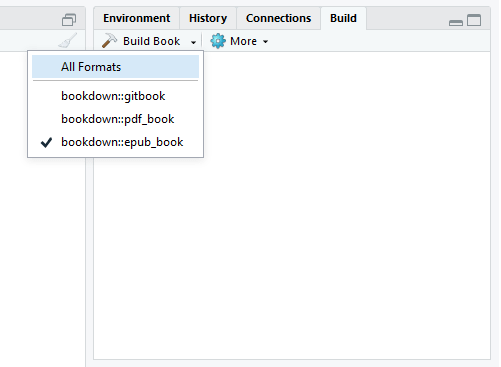

# Books

We have introduced the basics of R Markdown in Chapter \@ref(documents), which highlighted how HTML, PDF and Word documents can be produced from an R workflow. However, larger projects can become difficult to manage in a single R Markdown file. The **bookdown** package [@R-bookdown] addresses these limitations, and offers several key improvements:

- Books and reports can be built from multiple R Markdown files.
- Additional formatting features are added including cross-referencing, number of figures/equations/tables.
- Documents can easily be exported in a range of formats suitable for publishing , including PDF, ebooks and HTML websites.

Despite the  name containing the word "book", **bookdown** is not only for books, and can be used for anything designed to be read in a linear sequence, such as course handouts, study notes, a software manual, a thesis, or even a diary. In fact, many **bookdown** features apply to single R Markdown documents as well (see Section \@ref(a-single-document)).

In this chapter, we cover the basics of bookdown and explain how to get up and running with the project. Much of the the content is based on the work "*bookdown: Authoring Books and Technical Documents with R Markdown*" (https://bookdown.org/yihui/bookdown/) of @xie2016, which provides more detailed explanations of the concepts highlighted.

## Get started

You can install either the CRAN version or the development version on GitHub (https://github.com/rstudio/bookdown):

```{r eval=FALSE}
# install from CRAN
install.packages('bookdown')
    
# or GitHub
devtools::install_github('rstudio/bookdown')
```

If you use RStudio, you can start a new bookdown project from the menu `File -> New Project... -> New Directory -> Book Project using bookdown`.^[Alternatively, the command `bookdown:::bookdown_skeleton(getwd())` (N.B. `:::`) will create a skeleton project in your current working directory.] Open the R Markdown file `index.Rmd` and click the button Build Book on the Build tab of RStudio. Now you should see the index page of this book demo in the RStudio Viewer, which looks like Figure \@ref(fig:bookdown-template).  

You may add or change the R Markdown files, and hit the `Knit` button again to preview the book. If you prefer not to use RStudio, you may also compile the book through the command line. See Section \@ref(usage) for details.

```{r bookdown-template, echo=FALSE, fig.cap= "The HTML output of the bookdown template", out.width='100%', dpi = NA}
knitr::include_graphics("images/bookdown-template.png")
```

## Project structure

It can at first seem overwhelming starting a bookdown project, as there are quite a few files in the basic template. Below shows the basic structure of the bookdown template:

```markdown
directory/
├──  index.Rmd
├── 01-intro.Rmd
├── 02-literature.Rmd
├── 03-method.Rmd
├── 04-application.Rmd
├── 05-summary.Rmd
├── 06-references.Rmd
├── _bookdown.yml
├── _output.yml
├──  book.bib
├──  preamble.tex
├──  README.md
└──  style.css
```

As a summary of these files:

- `index.Rmd`: This is the only Rmd document to contain a YAML frontmatter as described within the \@ref(basics), and is the first book chapter.
- `Rmd files`: a typical **bookdown** book contains multiple chapters, and one chapter lives in one Rmd file.
- `_bookdown.yml`: settings to control how bookdown builds the book.
- `_output.yml`: specifies the formatting of the HTML, LaTeX/PDF and e-books.
- `preamble.tex` and `style.css`: allows for the appearance and styles of the files to be adjusted. Adjusting these are beyond the scope of this chapter, but are covered in Section \@ref(customization).

These files are explained in greater detail within the following subsections. 

### Index file

The `index.Rmd` file is the first file when merging all Rmd files. The appearance of this file is more familiar to the original R Markdown filetype and includes the YAML header:

```yaml
---
title: "A Minimal Book Example"
author: "Yihui Xie"
date: "`r Sys.Date()`"
site: bookdown::bookdown_site
documentclass: book
bibliography: [book.bib, packages.bib]
biblio-style: apalike
link-citations: yes
description: "This is a minimal example of using the bookdown package to write a book."
---
```

### Rmd files

Each R Markdown file does not require its own YAML header, but must start immediately with the chapter title using the first-level heading, e.g., `# Chapter Title`.

- 01-intro.Rmd

    ```markdown
    # Introduction
    
    This chapter is an overview of the methods that
    we propose to solve an **important problem**.
    ```
    
- 02-literature.Rmd

    ```markdown
    # Literature
    
    Here is a review of existing methods.
    ```

By default, bookdown merges all Rmd files by the order of filenames, e.g., `01-intro.Rmd` will appear before `02-literature.Rmd`. Filenames that start with an underscore `_` are skipped.

### _bookdown.yml

The `bookdown.yml` file allows you to specify optional setting used to be build the book. Most commonly, you may want to override the order in which files are merged by including  the field `rmd_files`.  For example,

```yaml
rmd_files: ["index.Rmd", "01-intro.Rmd", "02-literature.Rmd"]
```

### _output.yml

The `output.yml` file is used to specify the output formats book, and allows for the customization of the styles. Here is a brief example:

```yaml
bookdown::gitbook:
  lib_dir: assets
  split_by: section
  config:
    toolbar:
      position: static
bookdown::pdf_book:
  keep_tex: yes
bookdown::html_book:
  css: toc.css
```

Section \@ref(bookdown-output) provides further detail on how the output formats can be customized.

## Markdown extensions {#markdown-extensions}

**Bookdown** expands upon the markdown syntax Section outlined in \@ref(markdown-syntax). 

### Number and reference equations {#equations}

Section \@ref(math-expressions) highlighted how equations can be created using LaTeX syntax within Markdown. To number and refer to equations\index{equation}\index{cross-reference}, put them in the equation environments and assign labels to them using the syntax `(\#eq:label)`. Equation labels must start with the prefix `eq:` in **bookdown**. All labels in **bookdown** must only contain alphanumeric characters, `:`, `-`, and/or `/`. e.g.,

```latex
\begin{equation} 
  f\left(k\right) = \binom{n}{k} p^k\left(1-p\right)^{n-k}
  (\#eq:binom)
\end{equation} 
```

It renders the equation below:

\begin{equation}
f\left(k\right)=\binom{n}{k}p^k\left(1-p\right)^{n-k} (\#eq:binom)
\end{equation}

### Theorems and proofs {#theorems}

Theorems\index{theorem} and proofs provide a environment which are commonly used within articles and books in mathematics. To write a theorem, you can use the syntax below:

````markdown
`r ''````{theorem}
Here is my theorem.
```
````

```{theorem, pyth, name="Pythagorean theorem"}
For a right triangle, if $c$ denotes the length of the hypotenuse
and $a$ and $b$ denote the lengths of the other two sides, we have

$$a^2 + b^2 = c^2$$
```

The `proof` environment behaves similarly to theorem environments, and proof environments can also be named. The only difference is that since they are unnumbered. 

### Special headers

There are two special types of first-level headers than can be used in **bookdown**:

- Parts can be created using `(PART) Part I {-}`. These are useful if there are many chapters within a book.
- Appendices `(APPENDIX) Appendix {-}`: all chapters after this header will be treated as an appendix, and the numbering of the chapter will be `A1, A2, A3 etc.`.

An example of these both shown in use is provided below:

```
# (PART) Part I {-} 

# Chapter One

# Chapter Two

# (PART) Part II {-} 

# Chapter Three

# (APPENDIX) Appendix {-} 

# Appendix A

# Appendix B
```

### Text references

A text reference can be created which allows the label to be used elsewhere in the document.The sytax for a reference is `(ref:label) text` where `label` is a unique identifier and `text` which wants to be used throughout the document. For example:

```markdown
(ref:foo) Define a text reference **here**. 
```
Then you can use `(ref:foo)` in your figure/table captions. Text references can be used anywhere in the document, or where you want to reuse a fragment of text in multiple places. They are particularly useful feature where you want to assign a long caption to a figure, but do not want to contain the whole text within the code chunk. For example:

````markdown
A normal paragraph.

(ref:foo) A scatterplot of the data `cars` using **base** R graphics.

`r ''````{r foo, fig.cap='(ref:foo)'}
plot(cars)  # a scatterplot
```
````

### Cross Referencing

It was introduced previously that R Markdown allows for section titles (i.e. `# Chapter 1`) to be cross-referenced within a document. **Bookdown** extends this functionality, and allows tables, figures, equations and theorems to be cross-referenced automatically. This only works for numbered environments, and therefore requires figures and tables to be assigned a label. 

Cross-references are made in the format `\@ref(type:label)`, where `label` is the chunk label and `type` is the environment being referenced.  As examples:

````markdown
See Figure \@ref(fig:foo-1)

`r ''````{r foo-1, fig.cap= "A scatterplot"}
plot(cars)  # a scatterplot
```

See Table \@ref(tab:foo-2)

`r ''````{r foo-2}
knitr::kable(mtcars[1:5, 1:5],
             caption = "A caption")
```

See Theorem \@ref(thm:foo-3)

`r ''````{theorem, foo-3}
Here is my theorem.
```

See equation \@ref(eq:foo-4)

\begin{equation} 
  a + bx = c
  (\#eq:foo-4)
\end{equation} 

````

<!---`r ''`` THIS COMMENT REVERTS THE CODE FORMATTING
```--->

## Output Formats {#bookdown-output}

R Markdown supports three types of output formats: HTML, LaTeX/PDF and Word. Compared to R Markdown, **bookdown** provides additional functionality In this section, we introduce the possible options for these formats. The options of these outputs are controlled within the `_output.yml` file. 

- `gitbook`
- `html_book`
- `tufte_html_book`
- `pdf_book`
- `html_document2`
- `pdf_document2`
- `word_document2`

To find full documentation of the output formats in bookdown, see https://bookdown.org/yihui/bookdown/output-formats.html

### HTML

Although multiple formats are available for HTML books in **bookdown**, we will focus on the Gitbook style, which is the most popular format and is used by for the online version of this book. It provides a beautiful style, with a layout consisting of a sidebar showing the table of contents on the left, and the main body of a book on the right, with a responsive design to make the content suitable for both mobile and desktop.

`bookdown::gitbook()` is built upon the `rmarkdown::html_document()` which was explained in Section\@ref(html-document). The main difference between rendering in R Markdown and **bookdown** is  is that a book will generate multiple HTML pages by default. This makes it easier to readers to refer and share the work of each section, as they will each have their own HTML page. To change the way the HTML pages are split, the `split_by` argument can be specified. This defaults to `split_by: chapter`, but readers may prefer to use `split_by: section` if there are many sections within there book.

By default, the bibliography is split and relevant citation items are put at the bottom of each page, so that readers do not have to navigate to a different bibliography page to see the details of citations. This feature can be disabled using `split_bib = FALSE`, in which case all citations are put on a separate page.

### LaTeX/PDF

There are limited differences between the output of `pdf_book()` in **bookdown** compared to `pdf_document()` in **rmarkdown**, as the primary purpose of new format is to resolve the labels and cross-referencing written in the syntax described in Section \@ref(cross-referencing).

Pandoc supports LaTeX commands in Markdown. Therefore if the only output format that you want for a book is LaTeX/PDF, you may use the syntax specific to LaTeX, such as `\newpage` to force a page break. A major disadvantage of this approach is that LaTeX syntax is not portable to other output formats, and therefore these changes will not be transferred to the HTML or ebook outputs.

### E-Books

The E-book formats can be read on devices like smartphones, tablets, or special e-readers such as Kindle. **bookdown** supports EPUB without the installation of additional software packages. E-books are essentially a collection of HTML pages, however they are stored in a single `.epub` file.  To create an EPUB book, you can use the `epub_book()` function, which is similar to the `rmarkdown::html_document()`:

```{r epub-book, eval=FALSE, code=formatR::usage(bookdown::epub_book, output=FALSE), R.options=list(width=50)}
```

## A single document

We highlighted in Section \@ref(markdown-extensions) that **bookdown** extends the syntax provided by R Markdown, allowing automatic numbering of figures/tables/equations, and cross-referencing figures/tables/equations/sections. It can therefore be useful to use **bookdown** within single-file R Markdown documents to benefit from these features. The functions `html_document2()`, `tufte_html2()`, `pdf_document2()`, `word_document2()`, `tufte_handout2()`, and `tufte_book2()` are designed for this purpose. To use this in a traditional R Markdown document, we can replace the output YAML option as follows:

````yaml
---
title: "Untitled"
output: bookdown::pdf_document2
---
````

## Editing

**Bookdown** provides several ways to preview the book as you develop the book. In this section, we explain how to edit, build, preview, and serve the book locally.

### Build the book

To build all Rmd files into a book, you can call the `render_book()`. This uses the settings specified in the `_output.yml`, and if multiple file formats are specified, all the outputs will be built when the function is run.  If you are using RStudio, this can be accessed within the `Build` tab, and clicking on the drop down menu provides access if only one format wants to be built. If you cannot view the `Build` tab, make sure you have set `site: bookdown::bookdown_site` in the YAML of your index.Rmd and that the directory is an RStudio project.

(ref:bookdown-build) The build tab within RStudio highlighting **bookdown** output formats.

```{r bookdown-build, echo=FALSE, fig.cap= "(ref:bookdown-build)", out.width='50%', dpi = NA}

```

### Preview a chapter

Building the whole book can be slow when the size of the book is big or your book contains large amount of computation. We can use the `preview_chapter` function in **bookdown** to only build a single chapter at time. This is useful when you are writing a book, as you may often only want to preview the output of the work to quickly see whether you want to add or revise content in the chapter. Although the preview works for all output formats, we recommend that you preview the HTML output.

### Serve the book

Instead of running `render_book()` or `preview_chapter()` over and over again, you can actually live preview the book in the web browser, and the only thing you need to do is save the Rmd file. The function `serve_book()`\index{bookdown::serve\_book()} in **bookdown** can start a local web server to serve the HTML output based on the **servr** package [@R-servr]. The server will listen to changes in the book root directory: whenever you modify any files in the book directory, `serve_book()` can detect the changes, recompile the Rmd files, and refresh the web browser automatically. If the modified files do not include Rmd files, it just refreshes the browser (e.g., if you only updated a certain CSS file). This means once the server is launched, all you have to do next is simply write the book and save the files. Compilation and preview will take place automatically as you save files.

### Addins

The **bookdown** package comes with two addins for RStudio which assist the editing of books:^[If you are not familiar with RStudio addins, you may check out the documentation at http://rstudio.github.io/rstudioaddins/.]

- "Preview Book": this calls `bookdown::serve_book()` to compile and serve the book.
- "Input LaTex Math": provides a text box which allows you to write LaTeX equations, something which is typically error prone.

<!--- Removed mention of citr here: maybe include it within the citations part of the book --->

### Collaboration

The creation of books will usually require the involvement of multiple authors, editors, and reviewers. Even when the book is finished, readers may still want to provide feedback from time to time.

**Bookdown** makes it easy for people to collaborate on a project. Firstly, as the R Markdown syntax is very easy to pick up, contributors do not need to learn complicated syntax to be able to edit the work. As the chapters are stored as plain text files, **bookdown** projects are highly suitable for version control systems such as GitHub^[For example, this book is hosted at (https://github.com/rstudio/rmarkdown-book)]

## Publishing

As you develop the book, you make the draft book available to the public to get early feedback from readers, e.g., publish it to a website. After you finish writing the book, you need to think about options to formally publish it as either printed copies or e-books.

### RStudio Connect

The easiest way to publish books online is through https://bookdown.org, which is a website provided by RStudio to host your books for free.\index{bookdown.org} Books can be pushed to this website by using `bookdown::publish_book()`. You will need to sign up for an account at https://bookdown.org/connect/, and your login details will be used to authorize **bookdown** the first time you call the `publish_book()` function.

### GitHub

GitHub allow static HTML websites to be hosted for free via GitHub Pages. (https://pages.github.com). The website can be configured to automatically rebuild the website when any changes are made to the GitHub repository, ensuring that your book is always up-to-date with the latest changes without having to manually rebuild the site. Detailed guidance and scripts and configurations can be found in [Section 6.2](https://bookdown.org/yihui/bookdown/github.html) of the bookdown book, and `bookdown-demo` repository.

### Publishers

You can consider publishing physical copies of your book with a publisher or using a self-publishing. Many publishers provide LaTeX style classes which can be used to set the overall appearance of the book, and these can be used easily by setting the `documentclass` option in the YAML metadata of `index.Rmd`. Further customization of the appearance of the PDF book can be achieved by altering the LaTeX preamble in `preamble.tex`. For further detail see https://bookdown.org/yihui/bookdown/publishers.html.

