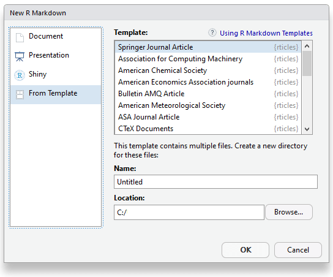

# Journals

Academic journals have strict guidelines on the formatting for submitted articles which authors must abide to. This will often require converting your report to LaTeX format, which can be be a slow and frustrating process.

The **rticles** package [@R-rticles] is designed to simplify the creation of documents that conform precisely to submission standards.  A suite of custom R Markdown templates for popular journals are provided by the package such as those shown in Figure \@ref(rticles-templates).

(ref:rticles-templates) A selection of  templates available through the *rticles* package

```{r rticles-templates, out.width="33%", fig.cap="(ref:rticles-templates)", fig.show = 'hold'}
knitr::include_graphics(c("images/rticles-elsevier.png", "images/rticles-plos.png", "images/rticles-springer.png"), dpi = NA)
```

An understanding of LaTeX is recommended, but not essential, to use this package. Templates will often contain LaTeX code but we can use use markdown and knitr syntax to produce figures, tables and maths equations as explained in Chapter \@ref(basics).

## Get started

You can install and use **rticles** from CRAN as follows:

```{r, eval = FALSE}
# Install from CRAN
install.packages("rticles", type = "source")

# Install development version
devtools::install_github("rstudio/rticles")
```

We would recommend the latest version of the package, as it contains the most up-to-date versions along with several new templates. 

If you are using RStudio, you can easily access the templates through `File -> New File -> RMarkdown...`. This will open the dialog box where you can select from one of the available templates as shown in Figure \@ref(fig:rticles-setup). If you are using the command line, you can use the `rmarkdown::draft` which requires you to specify a template i.e. `rmarkdown::draft("MyJSSArticle.Rmd", template = "jss_article", package = "rticles")`.

(ref:rticles-setup) RStudio Templates window showing available **rticles** templates

```{r rticles-setup, fig.cap="(ref:rticles-setup)"}

```

## rticles templates

The **rticles** package provides templates for a various journals and publishers, including:

- JSS articles
- R Journal articles
- CTeX documents
- ACM articles
- ACS articles
- AMS articles
- PeerJ articles
- Elsevier journal submissions
- AEA journal submissions
- IEEE Transaction journal submissions
- Statistics in Medicine journal submissions
- Royal Society Open Science journal submissions
- Bulletin de l'AMQ journal submissions
- MDPI journal submissions
- Springer journal submissions

The full list is available within R Markdown templates window in RStudio, or through the command `getNamespaceExports("rticles")`.

## Using a template

Templates have an extended YAML section compared to the basic R Markdown template, and allows you to specify additional details relevant to the custom template. For example, the *Springer* template includes:

```yaml
title: Title here
subtitle: Do you have a subtitle? If so, write it here
titlerunning: Short form of title (if too long for head)
authorrunning: Short form of author list if too long for running head
thanks: | 
    Grants or other notes about the article that should go on the front 
    page should be placed here. General acknowledgments should be placed at the
    end of the article.
authors: 
- name: Author 1
  address: Department of YYY, University of XXX
  email: abc@def
- name: Author 2
  address: Department of ZZZ, University of WWW
  email: djf@wef
keywords:
- key
- dictionary
- word
MSC:
- MSC code 1
- MSC code 2    
abstract: |
  The text of your abstract.  150 -- 250 words.
bibliography: bibliography.bib
output: rticles::springer_article
```

As the documents are built using a customized template, you may not use the YAML to control the layout of the document as described in Section \@ref(pdf-document), unless the template includes them. For example, adding `toc: true` will not add a table of contents. Commands which control the building process may still be used though, including `keep_tex: true`, or those which configures knitr i.e. `fig_width`.

## LaTeX content

As the only output format of the **rticles** format is PDF, the content of the documents may include LaTeX formatting. This means you may use LaTeX to produce figures and tables, for example:

```latex
\begin{figure}[ht]
\centering
\includegraphics[width=\linewidth]{foo}
\caption{An example image.}
\label{fig:foo}
\end{figure} 
```

Unless you have specific requirements for using LaTeX, we recommend that you use markdown and knitr formatting, as explained in Chapter \@ref(basics). This keeps you work generally more readable and less prone to formatting errors. For example, the above code block would be better represented as:

````markdown
`r ''````{r foo, out.width = "100%", fig.cap = "An example image.", echo = FALSE}
knitr::include_graphics("foo.png")
```
````

## Linking With bookdown

As explained in Section \@ref(bookdown-markdown), **bookdown** offers several extensions to the markdown syntax which can be particularly useful for academic writing, including cross-referencing of figures and tables. By default, **rticles** will use `rmarkdown::pdf_document` to build the document, but we can build the document using **bookdown** by changing the YAML as follows:

```yaml
output: 
  rticles::peerj_article:
    base_format: bookdown::pdf_document2
```

where `peerj_article` is replaced by the template you are using.

## Contributing templates

If you see the Github respoitory of **rticles** (https://github.com/rstudio/rticles), you will see that a lot of the templates have been created by members of the community. If you are interested in adding further journals templates, you may want to read Chapter \@ref(templates), which outlines how template can be made for RMarkdown. LaTeX templates can quickly be updated to handle Pandoc variables which can be defined in the YAML frontmatter.

